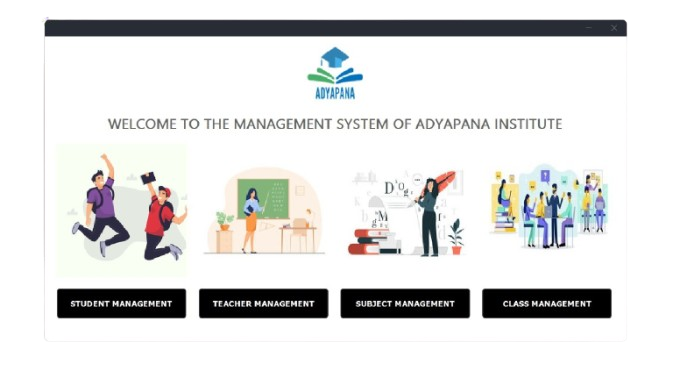
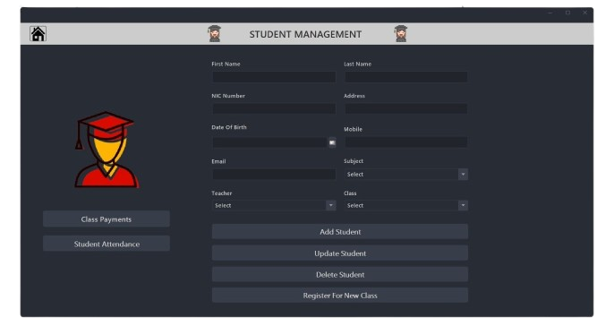
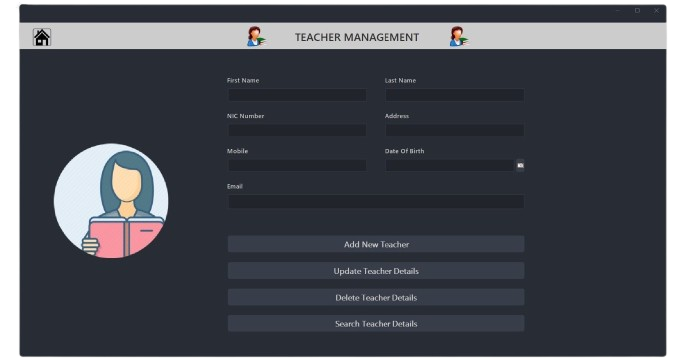
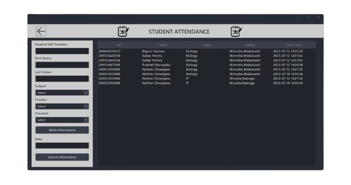
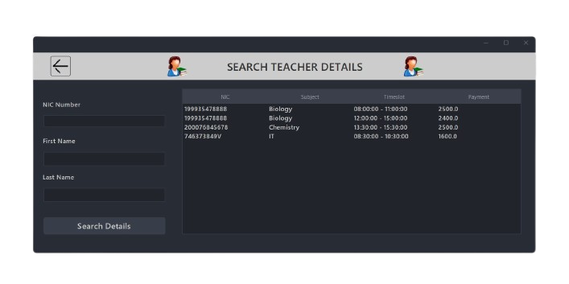
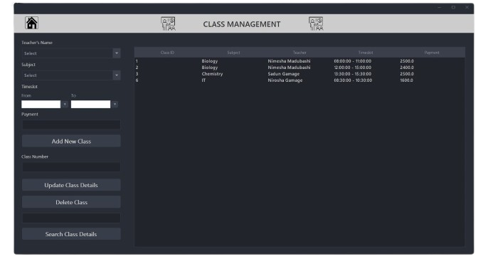

# Learning Management System (LMS) Desktop Application

A **Learning Management System (LMS)** built using **Java** and a **MySQL database**. This application enables efficient management of **courses**, **students**, and **assessments**, offering a user-friendly interface for both **learners** and **administrators**. It is designed to streamline the learning process and ensure smooth interaction between students, instructors, and administrators.

## 🚀 Features

- **Course Management**: Administrators can add, update, and manage courses offered in the system.
- **Student Management**: Add, remove, and manage student records, including enrollment and grades.
- **Assessment Management**: Create, assign, and grade assignments or exams.
- **User Roles**: Different roles for **students**, **instructors**, and **administrators** with different permissions.
- **User-friendly Interface**: Simple and intuitive GUI for both students and administrators to interact with the system.
- **Database Support**: MySQL is used to store all course, student, and assessment data.

## 🛠️ Technologies Used

- **Frontend**: Java Swing (for the Desktop GUI)
- **Backend**: Java
- **Database**: MySQL
- **JDBC**: Java Database Connectivity for database operations
- **Java Libraries**: Swing for UI components, MySQL JDBC Driver for database connection

## 📸 Screenshots

<div style="display: flex;">
  &nbsp;&nbsp;&nbsp;
  &nbsp;&nbsp;&nbsp;
  
</div>
<div style="display: flex;">
  &nbsp;&nbsp;&nbsp;
  &nbsp;&nbsp;&nbsp;
  
</div>

## 🛠️ Installation

### 1. Clone the Repository

```bash
git clone https://github.com/your-username/lms-desktop-app.git
cd lms-desktop-app
